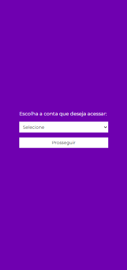

<h1 align="center">Bank Project - Supera Challenge</h1>

## ℹ️About the project
In this project, I developed a 2 page website where the user can see all the transactions a client made in the bank. I consumed data from an API developed by me. The repository of the backend of this project can be seen here: https://github.com/francinehahn/Bank-Backend-API-Rest

## 👩‍💻 Technologies
- Javascript
- React.js
- Styled-Components
- Axios

## ☑️ Functionalities
- `Home Page:`
    - The user can select which user account they want to see the bank transfers;
    - The page is responsive to all screen sizes;
- `User Information Page:`
    - The user can see all the bank transfers from the chosen account;
    - The user can filter the bank transfers by start and end dates and by the operator name;
    - The user can see the total balance and also the balance from the chosen period of time.

## 🛰 Running the project
<pre>
    <code>git clone https://github.com/francinehahn/Bank-Frontend-React.git</code>
</pre>

<pre>
    <code>cd Bank-Frontend-React</code>
</pre>

<pre>
    <code>npm install</code>
</pre>

<pre>
    <code>npm run dev</code>
</pre>

## 📷 Images

